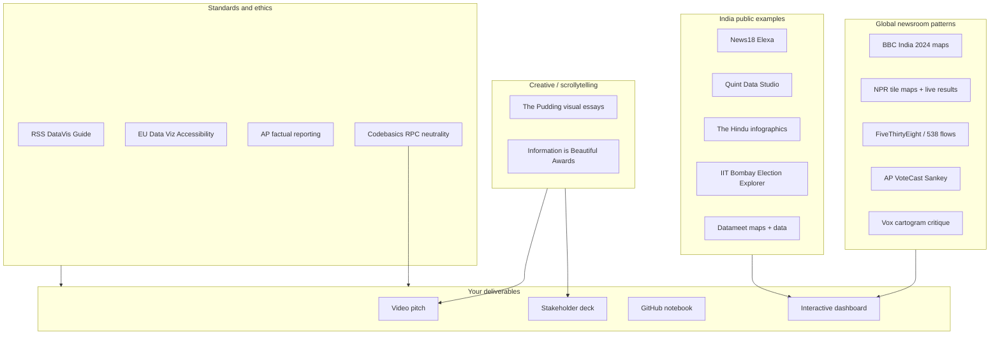

# Visual Design & Reference Master Guide

> **Current submission stack (May 2026):** React (`web/`) + FastAPI (`api/`) + ECharts. Run `uvicorn api.main:app --port 8000` (after `cd web && npm run build`) or `npm run dev` on :5173. Sections that mention **Streamlit** or `dashboard/app.py` are **design references only** — not the shipped RPC dashboard.

> **Deep insights page now live (`/deep`):** Effective Number of Parties (Laakso–Taagepera), Pedersen volatility, Gallagher LSq disproportionality, vote-share swing heatmap, anti-incumbency, representation gap, race competitiveness, district churn. All descriptive, ECI-only. Definitions in `docs/METRIC_DEFINITIONS.md`.

> **Purpose:** Single reference for building a **world-class, neutral, creative** Tamil Nadu 2026 election story — not limited to Codebasics rules. Use this alongside `HACKATHON_EXECUTION_PLAN.md` for submission logistics.

**How to use:** Pick **one headline story** → choose **3 chart types** from Section 8 → apply **accessibility + ethics** (Sections 9–10) → implement with **tech stack** (Section 11) → validate against **data sources** (Section 12).

---

## 1. Reference ecosystem (who to learn from)



---

## 2. Codebasics RPC (mandatory constraints)

| Item | Requirement |
|------|-------------|
| Deadline | 28 May 2026, 11:59 PM IST |
| Scoring | ~70% storytelling (video + deck), ~30% data hygiene |
| Data | ECI public + starter CSVs only |
| Tone | No causal claims, predictions, party praise/criticism |
| Visuals | No leader photos, party symbols |
| Deliverables | Video 5–7 min → Deck 8–10 slides → GitHub → Dashboard optional |
| Research | Pick **3** of 6 questions; weave **one** story |

Full detail: `HACKATHON_EXECUTION_PLAN.md`, `How_to_Submit.docx`, `metadata.txt`.

---

## 3. Global newsroom dashboards — patterns to adopt

### 3.1 BBC News — India 2024 election results

- **URL:** [BBC India 2024 results (interactive)](https://www.bbc.com/news/resources/idt-0385e7a0-3feb-4ab7-ab78-d80ad189e347)
- **Patterns:** Constituency-level drill-down; **year-over-year compare** (2024 vs 2019); battleground highlights; search; map scaled for **readability over geographic truth**
- **Steal for TN:** Compare **2026 vs 2021** at AC level; default to **regional summary** then drill to constituency

### 3.2 NPR — Election results & tile maps

- **Live results:** [NPR 2024 election apps](https://apps.npr.org/2024-election-results/)
- **Tile maps:** [NPR hex/tile map methodology](https://blog.apps.npr.org/2015/05/11/hex-tile-maps)
- **Patterns:** Don’t over-color incomplete counts; **uniform tiles** so rural ACs aren’t visually erased; sidebar filters
- **Steal for TN:** **234-tile mosaic** grouped by 6 editorial regions (not geographic choropleth if no clean shapefile)

### 3.3 Associated Press — AP VoteCast

- **URL:** [AP VoteCast 2024 (IIB showcase)](https://www.informationisbeautifulawards.com/showcase/7419-ap-votecast-a-visual-explainer-of-how-key-groups-voted-in-2024)
- **Patterns:** **Sankey** for flows between groups; scan path for casual users; deep tables for power users
- **Steal for TN:** **2021 winner party → 2026 winner party** Sankey (seat flows, not voter demographics)

### 3.4 FiveThirtyEight / 538

- **Forecast UX:** [538 2020 forecast (IIB)](https://www.informationisbeautifulawards.com/showcase/5638-fivethirtyeight-s-2020-election-forecast)
- **Demographics:** [Swing-O-Matic style tools](https://abcnews.com/538/demographic-swings-impact-2024-election/story?id=108700434)
- **Patterns:** Uncertainty as first-class citizen; plain-language “robotext”; accessibility audits; **avoid** implying prediction for RPC
- **Steal for TN:** **Margin distributions** and “how fragmented is the mandate” — descriptive only, no forecast

### 3.5 Vox & National Geographic — map literacy

- **Vox:** [Why election maps mislead](https://www.vox.com/2016/6/2/11828628/election-maps-hard)
- **NatGeo:** [Cartogram alternatives](https://www.nationalgeographic.com/culture/article/improved-election-map-cartograms)
- **Lesson:** Choropleths overweight land area; cartograms cost geography literacy; **tile grids** are the compromise
- **Steal for TN:** If you use a map, add **bar chart of same data** side-by-side (dual encoding)

### 3.6 ICA research — map type affects accuracy

- **Source:** Copernicus ICA work on election map types (choropleth vs cartogram vs block maps)
- **Lesson:** Saturated reds/blues increase perceived partisanship; **desaturate**; accent only key views
- **Steal for TN:** Use **muted Okabe–Ito** palette; never saffron/green dyads

---

## 4. India — public dashboards & data hubs

| Source | URL | What to study |
|--------|-----|----------------|
| **ECI results portal** | https://results.eci.gov.in/ | Official 2026 TN live results; turnout if missing in CSV |
| **ECI statistical reports** | https://www.eci.gov.in/statistical-reports | PDF validation, historical context |
| **TN CEO** | https://elections.tn.gov.in/ | State Form-20, master lists |
| **data.gov.in (ECI)** | https://data.gov.in | Downloadable CSV/Excel |
| **News18 Elexa** | https://www.news18.com/elections/analytics-center/ | Filters, grid/list/map, search |
| **Quint Data Studio** | https://www.thequint.com/quintlab/ | Live seat maps, constituency explorer |
| **The Hindu infographics** | e.g. Bihar 2025 results pages | Clean small-multiples, filterable charts |
| **IIT Bombay Election Explorer** | https://info-design-lab.github.io/General-Election-Explorer/ | Cartogram + map; ECI + Datameet |
| **Parliament 2009–2024 explorer** | https://data-analytics.github.io/Election_Data_2024/ | Multi-cycle compare UX |
| **IndiaVotes** | https://indiavotes.com | Cross-check constituency numbers |
| **Datameet election data** | https://github.com/datameet/india-election-data | Open historical datasets |
| **Datameet AC shapefiles** | https://github.com/datameet/maps/tree/master/assembly-constituencies | Choropleth (verify delimitation caveats) |
| **Trivedi Centre** | Ashoka / TCPD (2021 TN source in metadata) | Academic cleaning standards |

**TN-specific note:** Constituency boundaries on Datameet may be **pre-delimitation** for some states — document in limitations if used.

---

## 5. Creative & award-winning visual journalism

### 5.1 The Pudding — visual essays

- **Method:** [How Pudding structures visual essays](https://www.storybench.org/pudding-structures-stories-visual-essays/)
- **Scrollytelling:** [Scrollytell.ing examples](https://scrollytell.ing/)
- **Patterns:** Pinned chart + scrolling narrative; sparse words; data carries conclusion
- **Steal for RPC:** **Video** = spoken scrollytelling; deck slide 1 = “pinned” headline chart

### 5.2 Information is Beautiful Awards

- Browse: https://www.informationisbeautifulawards.com/ (Current Affairs & Politics)
- **Steal:** One **hero visual** (Sankey or mosaic) that works without reading body text

### 5.3 Other high-impact formats (industry)

| Format | Best for | Example use in TN RPC |
|--------|----------|------------------------|
| **Sankey / alluvial** | Party seat flows 2021→2026 | Q2 Flips |
| **Tile / waffle grid** | 234 ACs equal visual weight | Q1 Geographic + explorer |
| **Sunburst / treemap** | Region → party hierarchy | Regional seat composition |
| **Slope / bump chart** | Rank or metric change by entity | Margin 2021 vs 2026 by AC sample |
| **Beeswarm / strip** | Distribution of margins | Q6 fragmentation |
| **Marimekko** | Vote share composition by region | Q3 TVK footprint (descriptive) |
| **Chord diagram** | Flow matrix (use sparingly — hard to read) | Alternative to Sankey |
| **Parallel coordinates** | Multi-metric AC profiles | Power-user dashboard tab |
| **Small multiples** | 6 regions same chart type | Q1 |
| **Dumbbell chart** | Two-year comparison | Turnout delta (if scraped) |

---

## 6. Accessibility & inclusive design (required for “best” work)

| Standard | URL | Apply |
|----------|-----|--------|
| **EU Data Visualization Guide** | https://data.europa.eu/apps/data-visualisation-guide/ | Contrast ≥4.5:1 text; don’t use color alone |
| **RSS Best Practices** | https://royal-statistical-society.github.io/datavisguide/ | Direct labels, alt text, chart choice |
| **Urban Institute — Do No Harm** | https://www.urban.org/research/publication/do-no-harm-guide | Center accessibility from day one |
| **CT Open Data guidelines** | https://ctopendata.github.io/data-visualization-guidelines/ | Audience, goals, tables alongside charts |
| **Okabe–Ito palette** | Standard colorblind-safe set | Default party-agnostic colors |
| **WCAG 2.x** | W3C | Keyboard nav for web dashboard; semantic HTML |

**Checklist before ship:**

- [ ] No red–green only encoding  
- [ ] Labels on lines/bars (not legend-only)  
- [ ] Tooltips + **data table** export for each main chart  
- [ ] Alt text / short description for deck stills  
- [ ] Font size ≥12pt equivalent on TV-safe deck charts  

---

## 7. Neutral reporting & ethics (aligns with RPC disqualification rules)

| Source | Principle |
|--------|-----------|
| **AP Elections** | Report facts; explain methodology; no “likely winner” without math path |
| **ACE Project (media ethics)** | Separate fact from opinion; balance; label commentary |
| **RPC brief** | No causal “why party won”; no predictions; ECI-only |

**Safe chart title templates:**

- ✅ “108 constituencies had TVK as leading candidate in published results”  
- ❌ “TVK destroyed DMK in the south”  

- ✅ “Average winning margin was 7.7% in 2026 vs 11.8% in 2021 (valid votes, excl. NOTA)”  
- ❌ “Voters rejected the ruling party”  

---

## 8. Chart playbook → TN 2026 research questions

| RPC question | Primary chart | Secondary | Inspiration |
|--------------|---------------|-----------|-------------|
| **Q1 Geographic** | Regional stacked bars OR tile mosaic by region | Small multiples map | BBC, NPR tiles |
| **Q2 Flips** | Sankey (2021 party → 2026 party) | Highlight table of flipped ACs | AP VoteCast |
| **Q3 TVK vote share** | Marimekko or grouped bars by region | Dot plot statewide shares | 538 composition charts |
| **Q4 Reserved seats** | Faceted bars GEN vs SC vs ST | Same metrics, side-by-side years | Hindu small-multiples |
| **Q5 Turnout** | Dumbbell top-20 ACs | Choropleth if turnout scraped | ECI portal + Quint live maps |
| **Q6 Margins** | Beeswarm/box/violin | KPI: % seats winner &lt;35% share | FiveThirtyEight uncertainty framing |

**Recommended “creative hero” trio (data-backed):**

1. **234-cell tile mosaic** (2026 winner, filter by region/flip)  
2. **Sankey** seat flows 2021→2026  
3. **Margin beeswarm** 2021 vs 2026 overlay  

---

## 9. Tech stack decision matrix

| Tool | Strengths | Weaknesses | Best for |
|------|-----------|------------|----------|
| **Streamlit** | Fast Python, filters, Plotly embed | Custom design limits | Hackathon dashboard + demo |
| **Plotly / Dash** | Sankey, interactivity, export | Dash learning curve | Sankey + drill-down |
| **Tableau Public** | Polish, sharing gallery | Repro on GitHub harder | Impressive static/interactive publish |
| **Power BI** | Corporate deck alignment | Less “creative web” feel | If reviewer expects Microsoft stack |
| **D3.js / Observable** | Maximum creativity | Time-intensive | Portfolio-grade custom viz |
| **Flourish** | Animated bars, Sankey templates | Hosted dependency | Quick hero GIF for LinkedIn |
| **Jupyter + Matplotlib** | Reproducibility | Less interactive | Notebook grading |
| **GeoPandas + Folium/Plotly** | Real maps | Boundary QA burden | Only with Datameet + caveats |

**Recommended stack for “creative + submittable”:**

```
pandas → processed CSVs
plotly → Sankey, mosaic, beeswarm
streamlit → multipage app (st.navigation)
kaleido → PNG exports for deck
jupyter → reproducibility
```

---

## 10. Dashboard information architecture (BBC + NPR + News18 hybrid)

### 10.1 Page structure (Streamlit multipage)

| Page | User question | Key widgets |
|------|---------------|-------------|
| **Overview** | “What happened statewide?” | KPI row, headline, editorial rec card |
| **Flow** | “How did seats move?” | Sankey, flip count |
| **Regions** | “Where?” | Tile mosaic + regional bars |
| **Fragmentation** | “How close were races?” | Margin beeswarm, &lt;35% table |
| **Explorer** | “Tell me about one AC” | Search `ac_number`, candidate table |
| **Methods** | “Can I trust this?” | Definitions, sources, limitations |

### 10.2 UX best practices

- **Streamlit:** `st.set_page_config(layout="wide")`, `@st.cache_data`, filters in sidebar ([Streamlit multipage docs](https://docs.streamlit.io/develop/concepts/multipage-apps/page-and-navigation))  
- **NPR:** Equal visual weight per constituency in grids  
- **BBC:** Year toggle 2021 | 2026 everywhere  
- **News18:** Search + sort on constituency table  
- **Do not:** Auto-play sound; flashing colors; 3D pie charts  

### 10.3 Visual design system (neutral)

```text
Background:   #0f1419 (dark) or #f8fafc (light) — pick one theme, stay consistent
Text:         #e2e8f0 / #1e293b
Accent:       #3b82f6 (navigation only — not party-coded)
Party series: Okabe–Ito — assign arbitrarily by alphabet, document in README
Font:         Inter, Source Sans 3, or system-ui
Chart height: 480–600px for hero; 320px for small multiples
```

---

## 11. Data pipeline (all sources)

```
Starter pack (ac_number join)
  tn_2021_results.csv
  tn_2026_results.csv
  constituency_master.csv

Optional enrichment
  ECI results.eci.gov.in → 2026 turnout (blank in starter CSV)
  eci.gov.in/statistical-reports → audit PDFs
  datameet/maps → AC boundaries (with limitation footnote)
  indiavotes.com → spot checks

Derived tables (you create)
  ac_summary_2021.csv
  ac_summary_2026.csv
  ac_comparison.csv
  party_normalize.csv
  sankey_edges.csv
```

**Metrics:** See `docs/METRIC_DEFINITIONS.md` (create when building) — valid votes excl. NOTA, margin%, flip flag.

---

## 12. Creative build blueprint (end-to-end)

### Phase A — Data (Day 1–2)
1. Copy raw → `data/raw/`  
2. Build `party_normalize.csv` (top 30 raw labels)  
3. Export `ac_comparison.csv` (234 rows)  
4. Validate 2 ACs manually against ECI  

### Phase B — Hero visuals (Day 3–5)
1. **C1** Tile mosaic — Plotly scatter grid or custom CSS grid in Streamlit  
2. **C2** Sankey — `go.Sankey` ([Plotly docs](https://plotly.com/python/sankey-diagram/))  
3. **C3** Margin beeswarm — `px.strip` or violin by year  
4. Export 1920×1080 PNG → `outputs/charts/`  

### Phase C — Dashboard (Day 5–7)
1. `streamlit run dashboard/app.py`  
2. Multipage navigation + sidebar filters (region, reserved, flip)  
3. `st.query_params` for shareable AC links (optional)  

### Phase D — Story package (Day 7–10)
1. Deck: hero = C1, slides 2–4 = C2–C3 + one regional bar  
2. Video: screen-record dashboard + face cam  
3. README: reproduction + neutrality disclaimer  

### Phase E — Submit (Day 10–12)
1. GitHub public  
2. YouTube unlisted  
3. LinkedIn (tags per `How_to_Submit.docx`)  
4. RPC portal URL  

---

## 13. Master submission checklist (everything)

### Content quality
- [ ] One sentence headline works standalone  
- [ ] 3 research questions answered with depth  
- [ ] Editorial recommendation for 60-min show  
- [ ] Limitations slide (Form-20, normalization, turnout)  

### Visual quality
- [ ] Hero visual understandable in 5 seconds  
- [ ] 3 distinct chart types (not 3 bar charts)  
- [ ] Accessibility checklist (Section 6)  
- [ ] Neutrality tone audit (Section 7)  

### Technical
- [ ] Notebook runs clean env  
- [ ] Dashboard runs via documented command  
- [ ] Numbers match between deck, video, dashboard  

### Distribution
- [ ] Public GitHub  
- [ ] Video link  
- [ ] LinkedIn: `@codebasics`, Hemanand Vadivel, Dhaval Patel, Govt of Tamil Nadu  
- [ ] Hashtags: `#ResumeProjectChallenge #Codebasics #DataAnalytics #TamilNaduElection2026`  
- [ ] RPC page submission  

---

## 14. Curated bibliography (bookmark list)

### Maps & geography
- NPR tile maps: https://blog.apps.npr.org/2015/05/11/hex-tile-maps  
- Vox on misleading maps: https://www.vox.com/2016/6/2/11828628/election-maps-hard  
- Datameet AC maps: https://github.com/datameet/maps/tree/master/assembly-constituencies  

### Interactivity & charts
- Plotly Sankey: https://plotly.com/python/sankey-diagram/  
- Plotly Sankey deep dive: https://plotly.com/blog/sankey-diagrams  
- Python graph gallery Sankey: https://python-graph-gallery.com/sankey-diagram-with-python-and-plotly/  

### Journalism & storytelling
- Pudding structure: https://www.storybench.org/pudding-structures-stories-visual-essays/  
- AP election role: https://www.ap.org/elections/our-role/how-we-call-races  

### Accessibility
- RSS styling guide: https://royal-statistical-society.github.io/datavisguide/docs/styling.html  
- EU accessible palettes: https://data.europa.eu/apps/data-visualisation-guide/accessible-colour-palettes  

### India data
- ECI results: https://results.eci.gov.in/  
- IIT Election Explorer: https://info-design-lab.github.io/General-Election-Explorer/  
- Datameet india-election-data: https://github.com/datameet/india-election-data  

### Tools
- Streamlit multipage: https://docs.streamlit.io/develop/concepts/multipage-apps/page-and-navigation  
- Information is Beautiful Awards: https://www.informationisbeautifulawards.com/  

### This project
- `HACKATHON_EXECUTION_PLAN.md`  
- `input_files_for_participants_rpc/`  

---

## 15. What “most creative” means for this RPC

Creativity **≠** more chart types. It means:

1. **One unforgettable hero** (tile mosaic or Sankey) that reviewers remember after the video  
2. **Clear narrative arc** in the dashboard (Overview → Why it matters → Proof → Explorer)  
3. **Dual encoding** (mosaic + table, map + bar) so accessibility and trust increase  
4. **Honest limitations** surfaced in UI, not hidden in README footnotes  
5. **Production polish** — consistent theme, no clutter, fast filters  

Avoid: 3D pies, party-flag colors, leader images, causal headlines, prediction language.

---

*Document version: 1.0 — consolidates global, India, creative, ethical, and RPC-specific references.*
